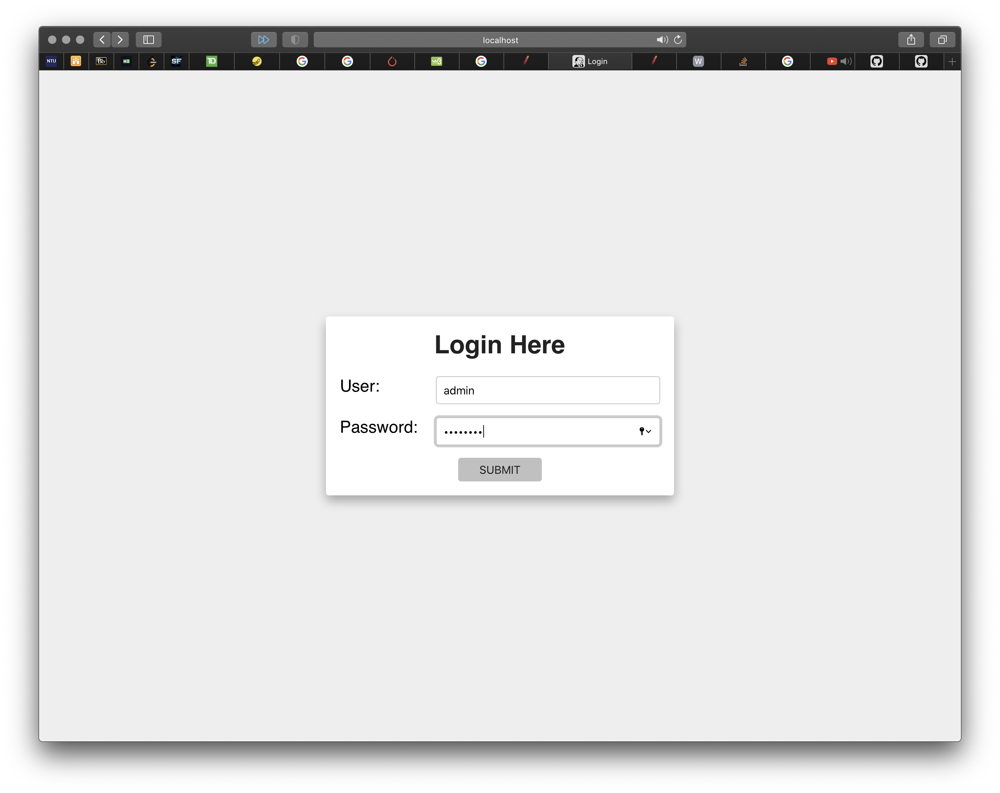
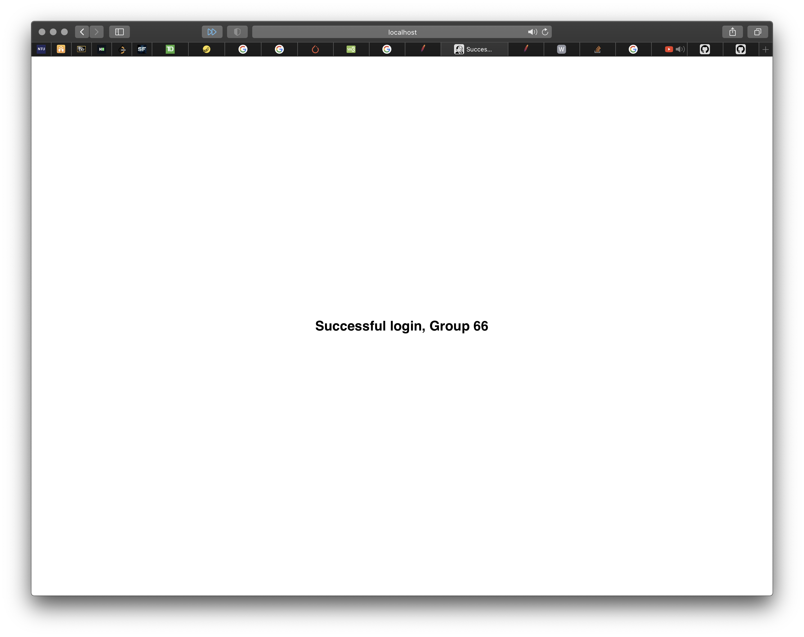

# ASE-Assignment
## NTU CZ3002 Advanced Software Engineering - Group 66
Making a web application with Struts.

## TODO

- Rename helloworld directories to suitable name
- Shift success and error jsp files into model instead
- CSS for login, success and error pages
- .war file for Servlet container in Tomcat (required?)

## Run locally

### Install Maven and JDK before execution
* Download [JDK](https://www.oracle.com/java/technologies/javase-jdk15-downloads.html)
* Follow the [steps](https://stackoverflow.com/questions/2619584/how-to-set-java-home-on-windows-7) here and set JDK to correct path for Maven to run.
* Download [Maven](https://apachemirror.sg.wuchna.com/maven/maven-3/3.6.3/binaries/apache-maven-3.6.3-bin.tar.gz)

### Maven
`set PATH="c:\program files\apache-maven-3.6.3\bin";%PATH%`

`mvn jetty:run`

> Web app will be up @ [http://localhost:8080/hello-world/index.action](http://localhost:8080/helloworld/index.action)

### MySql

My MYSQL database has the username "root" and "Ase123456" password

`mysql -uroot -pAse123456`

> to do any mysql queries in terminal

```mysql
CREATE TABLE `struts_tutorial`.`login` (
   `user` VARCHAR( 10 ) NOT NULL ,
   `password` VARCHAR( 10 ) NOT NULL ,
   `name` VARCHAR( 20 ) NOT NULL ,
   PRIMARY KEY ( `user` )
) ENGINE = InnoDB;
```

> create inital table, can vary the maximum length :) 

```mysql
INSERT INTO `struts_tutorial`.`login` (`user`, `password`, `name`)
VALUES ('admin', 'password', 'Group 66');
```

> create ase admin credentials

## Images

### Login Page



### Login Success


